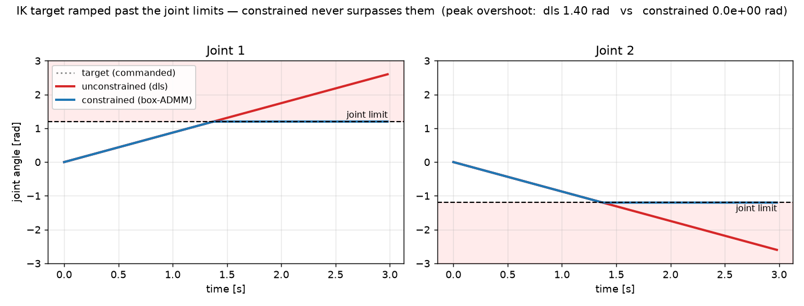
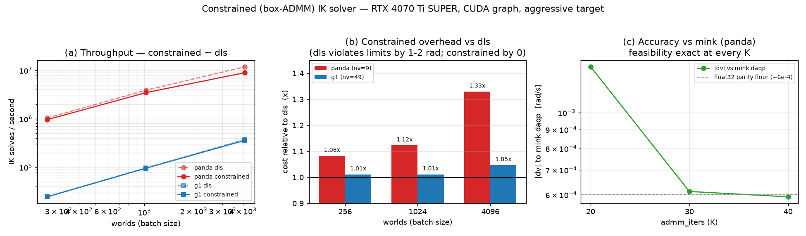

# mink-warp benchmark results

Reference numbers from the harness in this directory. Reproduce with the commands
under each table. Throughput = IK **solves per second** (worlds × steps ÷ wall time);
`us/solve` = per-step wall time ÷ world count.

## Environment

| | CPU run | GPU run |
|---|---|---|
| Host | Apple Silicon laptop (dev machine) | NVIDIA **RTX 4070 Ti SUPER** (16 GB, driver 580.126) |
| Backend | warp 1.14 **CPU** (no CUDA) | warp 1.14 **CUDA**, `device=cuda:0` |
| Solve mode | eager | eager + **CUDA graph** (`--graph`) |
| dtype | float32 | float32 |
| dt | 10 ms (100 Hz) | 10 ms |

## Throughput — `panda` scene (fixed base, `FrameTask` + `PostureTask`, nv=9)

| worlds | CPU solves/s | CPU µs/solve | GPU solves/s | GPU µs/solve | GPU/CPU |
|-------:|-------------:|-------------:|-------------:|-------------:|--------:|
| 1      |        2,931 |       341.2  |        6,708 |       149.1  |   2.3×  |
| 16     |       39,794 |        25.1  |      102,634 |         9.74 |   2.6×  |
| 64     |       96,154 |        10.4  |      362,228 |         2.76 |   3.8×  |
| 256    |      163,529 |         6.12 |      875,620 |         1.14 |   5.4×  |
| 1024   |      195,326 |         5.12 |    3,309,956 |         0.30 |  16.9×  |
| 4096   |          —   |         —    |   10,245,969 |         0.10 |    —    |
| 16384  |          —   |         —    |   16,091,936 |         0.06 |    —    |

```bash
uv run python benchmarks/bench_ik.py panda --batches 1 16 64 256 1024 --steps 120       # CPU
uv run python benchmarks/bench_ik.py panda --graph --batches 1 16 64 256 1024 4096 16384 # GPU
```

## Throughput — `g1` scene (floating base, pelvis `FrameTask` + `PostureTask` + `ComTask`, nv=49)

| worlds | CPU solves/s | CPU µs/solve | GPU solves/s | GPU µs/solve | GPU/CPU |
|-------:|-------------:|-------------:|-------------:|-------------:|--------:|
| 1      |        2,101 |       476.0  |          715 |      1399.1  |   0.34× |
| 16     |        8,846 |       113.1  |        9,350 |       106.9  |   1.06× |
| 64     |       10,639 |        94.0  |       10,430 |        95.9  |   0.98× |
| 256    |       11,186 |        89.4  |       24,547 |        40.7  |   2.2×  |
| 1024   |          —   |         —    |       96,791 |        10.3  |    —    |
| 4096   |          —   |         —    |      372,495 |         2.68 |    —    |

```bash
uv run python benchmarks/bench_ik.py g1 --batches 1 16 64 256 --steps 60                 # CPU
uv run python benchmarks/bench_ik.py g1 --graph --batches 1 16 64 256 1024 4096 --steps 150 # GPU
```

## Single-environment baseline (1 world) — vs mink

| library | device | solves/s | µs/solve |
|---|---|-------:|-------:|
|mink| CPU | 18,371 | 54.4 |
| mink-warp | CPU | 2,977 | 335.9 |
| mink-warp | GPU | 6,708 | 149.1 |

```bash
uv run python benchmarks/bench_parity.py panda --steps 200   # prints this baseline + the parity below
```

## Accuracy parity vs mink (`panda`, oracle = mink CPU `daqp`, `limits=[]`)

| metric | CPU mink-warp | GPU mink-warp |
|---|---|---|
| tangent-velocity `\|Δv\|` mean | 2.59e-4 | 2.67e-4 |
| `\|Δv\|` max | 2.52e-3 | 2.52e-3 |
| `\|Δv\|` p99 | 2.43e-3 | 2.45e-3 |
| configuration `\|Δq\|` max | 2.56e-5 | 2.55e-5 |

```bash
uv run python benchmarks/bench_parity.py panda --steps 200        # CPU / GPU
```

## Solver backends — throughput vs tracking accuracy

Three interchangeable backends minimise the same weighted task cost behind one
`solve_and_integrate` API: **`dls`** (one damped Gauss-Newton step/tick, default),
**`lm`** (Levenberg-Marquardt), **`lbfgs`** (limited-memory BFGS). Default inner
iterations per call: `dls`=1, `lm`=2, `lbfgs`=5 (LM is a full Newton step and
converges in ~1–2 iterations; L-BFGS starts from steepest descent and needs a few
to ramp up). `|Δpos|` = world-0 tracked-frame distance to its target [m]; lower =
tighter tracking, and is device-independent (float32, same math on CPU/GPU).

Each scene (`panda`, `g1`) runs under every backend (`dls`/`lm`/`lbfgs`) at two
target speeds (`--motion gentle|aggressive`). `solves/s` = worlds × steps ÷ wall
time; GPU batched columns use CUDA-graph capture (`dls`/`lm`; `lbfgs` is eager).

The distinction is **how fast the target moves per control tick**:

- **Gentle** (default) — the target creeps, so a single Gauss-Newton step per tick
  already converges. Every backend tracks equally; LM/L-BFGS only cost throughput.
- **Aggressive** — the target moves ~10× faster, so one linear step lags and LM's
  re-linearization tracks visibly tighter (up to ~8× on `g1`). This is where the
  optimizer backends earn their per-call cost.

Across both, the optimizer backends also add robustness where a plain GN step
overshoots — ill-conditioned Jacobians or unreachable targets (an out-of-reach
target winds an undamped DLS arm through many revolutions while LM settles at the
closest pose). L-BFGS trails on the stiff floating-base `g1` (its line search
stalls; more `--iters` doesn't help), and suits well-conditioned redundant arms.

CPU = Apple Silicon (eager); GPU = RTX 4070 Ti SUPER (1 world eager, batched CUDA graph).

### Gentle motion (default trajectory)

Target creeps ~3e-3 m/tick (`panda`) — one GN step already converges, so every
backend tracks equally; the optimizer backends only cost throughput here.

`panda` (fixed base, `FrameTask` + `PostureTask`, nv=9):

| solver | iters | CPU 1w | CPU 256w | GPU 1w | GPU 4096w | `\|Δpos\|` mean | `\|Δpos\|` max |
|---|--:|--:|--:|--:|--:|--:|--:|
| dls   | 1 | 2,861 | 154,987 | 2,016 | 9,610,689 | 2.6e-4 | 8.4e-4 |
| lm    | 2 |   884 |  48,418 |   623 | 3,672,702 | 2.4e-4 | 8.2e-4 |
| lbfgs | 5 |   118 |   8,148 |    84 |   344,084 | 3.3e-3 | 8.2e-3 |

`g1` (floating base, pelvis `FrameTask` + `PostureTask` + `ComTask`, nv=49):

| solver | iters | CPU 1w | CPU 256w | GPU 1w | GPU 4096w | `\|Δpos\|` mean | `\|Δpos\|` max |
|---|--:|--:|--:|--:|--:|--:|--:|
| dls   | 1 | 2,034 | 11,224 |   678 | 371,657 | 9.6e-3 | 1.9e-2 |
| lm    | 2 |   589 |  4,116 |   333 | 278,111 | **3.2e-3** | **4.2e-3** |
| lbfgs | 5 |    98 |  1,662 |    75 | 223,299 | 4.1e-2 | 6.0e-2 |

### Aggressive motion (`--motion aggressive`)

Target moves ~10× faster (`panda` ~3e-2 m/tick, `g1` ~1.4e-2 m/tick). Now one GN
step lags and LM's re-linearization pays off — dramatically on `g1`, where LM at
iters=2 tracks **~8× tighter than DLS** for ~1.3× the GPU throughput at 4096
worlds. L-BFGS still trails on these stiff/fast problems. Throughput is unchanged
from gentle (same work per tick); only `|Δpos|` differs, so only it is shown.

`panda`:

| solver | iters | GPU 4096w (solves/s) | `\|Δpos\|` mean | `\|Δpos\|` max |
|---|--:|--:|--:|--:|
| dls   | 1 | 9,666,182 | 1.53e-2 | 7.49e-2 |
| lm    | 2 | 3,718,200 | **1.37e-2** | **5.19e-2** |
| lbfgs | 5 |   341,341 | 3.90e-2 | 9.95e-2 |

`g1`:

| solver | iters | GPU 4096w (solves/s) | `\|Δpos\|` mean | `\|Δpos\|` max |
|---|--:|--:|--:|--:|
| dls   | 1 | 371,722 | 3.77e-2 | 1.12e-1 |
| lm    | 2 | 278,219 | **4.87e-3** | **9.25e-3** |
| lbfgs | 5 | 223,687 | 7.75e-2 | 1.20e-1 |

```bash
# any scene x any backend x motion, throughput + tracking accuracy
uv run python benchmarks/bench_solvers.py g1 --nworld 256                                    # CPU, gentle
uv run python benchmarks/bench_solvers.py g1 --motion aggressive --nworld 4096 --graph --device cuda:0
```

### LM throughput sweep (`panda`, GPU, CUDA graph, iters=2)

| worlds | solves/s | µs/solve |
|-------:|---------:|---------:|
| 1      |     2,998 |  333.6 |
| 64     |   149,294 |   6.70 |
| 1024   | 1,290,000 |   0.78 |
| 4096   | 3,870,652 |   0.26 |
| 16384  | 5,047,604 |   0.20 |

```bash
uv run python benchmarks/bench_ik.py panda --solver lm --graph --batches 1 64 1024 4096 16384
```

## Constrained solver — hard joint limits (box-ADMM)

The `constrained` backend enforces hard joint **limits** (mink's
`ConfigurationLimit` / `VelocityLimit`) by solving, per world, the same QP as
mink — `min ½ ΔqᵀHΔq + cᵀΔq s.t. lo ≤ Δq ≤ hi` — with OSQP-style box-ADMM:
factor `M = H + ρI` once with the existing tile Cholesky, then `admm_iters`
cached-solve + box-clip + dual-update steps, returning the projected step, which
lies **inside the box at every iteration**. So limits are never violated, even
at `admm_iters=1` or when the target drives the arm hard into a bound — unlike
the soft `JointLimitTask` penalty. `ρ = ρ_scale·√(min·max diag H)` self-scales
across scenes; default `admm_iters=30`, `ρ_scale=1.0`.

When a target is ramped straight past the joint limits, the unconstrained `dls`
step follows it into the forbidden zone while the constrained solver clamps at
the limit — its per-step overshoot is exactly 0:



**Accuracy vs mink** (`daqp` + `ConfigurationLimit`, world 0, lockstep): `|Δv|`
reaches the float32 parity floor (~6e-4, same as the unconstrained DLS floor) by
`admm_iters≈30`. Feasibility is exact at *any* iteration count.

| admm_iters | `\|Δv\|` mean | `\|Δv\|` max | max limit violation |
|--:|--:|--:|--:|
| 20 | 1.33e-3 | 2.90e-3 | **0** |
| 30 | 6.12e-4 | 2.53e-3 | **0** |
| 40 | 5.92e-4 | 2.53e-3 | **0** |

**Throughput vs `dls`** (GPU RTX 4070 Ti SUPER, CUDA graph, aggressive target
`--amp-scale 3` that pushes joints into their limits). `max viol` = worst joint-
limit overshoot over the run: `dls` (no limits) blows through by ~1–2 rad; the
constrained solver holds it at **0** for a small throughput cost that shrinks
with nv (the one-off factor amortizes over the batch and the K cheap solves are
relatively free on the larger model).

| scene | worlds | dls solves/s | constrained solves/s | overhead | dls max viol | constrained max viol |
|---|--:|--:|--:|--:|--:|--:|
| panda (nv=9)  | 256  |  1,038,419 |   959,042 | 1.08× | 0.99 rad | **0** |
| panda (nv=9)  | 1024 |  3,891,933 | 3,466,640 | 1.12× | 0.99 rad | **0** |
| panda (nv=9)  | 4096 | 11,843,821 | 8,909,478 | 1.33× | 0.99 rad | **0** |
| g1 (nv=49)    | 256  |     24,800 |    24,530 | 1.01× | 2.24 rad | **0** |
| g1 (nv=49)    | 1024 |     96,851 |    95,761 | 1.01× | 2.24 rad | **0** |
| g1 (nv=49)    | 4096 |    374,662 |   357,958 | 1.05× | 2.24 rad | **0** |



Throughput tracks `dls` (factor-once ADMM), the per-solve overhead shrinks with
model size (1.08–1.33× on panda nv=9, 1.01–1.05× on g1 nv=49), and accuracy vs
mink `daqp` reaches the float32 parity floor (~6e-4) by `admm_iters≈30`.

```bash
# accuracy sweep vs mink (parity scene), and throughput + violation vs dls
uv run python benchmarks/bench_constrained.py panda --check --iters 20 30 40 --device cuda:0
uv run python benchmarks/bench_constrained.py panda --solvers dls constrained --nworld 4096 --amp-scale 3 --graph --device cuda:0
uv run python benchmarks/bench_constrained.py g1    --solvers dls constrained --nworld 4096 --amp-scale 3 --graph --device cuda:0
```

_Numbers will shift with GPU model, batch, task stack, and warp/mujoco-warp versions. Re-run on
your target hardware._
